# work/ 性能分析报告

## 数据与评估设置
- 训练集: `data/processed/work/train_chon20_manifest.json` (total_kept=6151)
- 验证集: `data/processed/work/test_chon20_manifest.json` (total_kept=1000)
- 评估指标: RMSD (mean/median/p90/p95 等), 由 `scripts/eval_predictions.py` 输出

## 全局最佳结果 (按 RMSD)
- 最低 mean RMSD: `etkdg_c1_mmff0_seed0_it200` (etkdg, mean=1.147, median=1.123)
- 最低 median RMSD: `egnntr_hd128_l5_h4_lr1e_4_ep100_n5000` (egnn_transformer, mean=1.162, median=1.118)

<!-- AUTO-PLOTS-START -->
## 最优模型训练损失曲线
- 最优可训练模型: `egnntr_hd128_l5_h4_lr1e_4_ep100_n5000` (egnn_transformer, mean=1.162, median=1.118)
- 训练 loss 曲线: 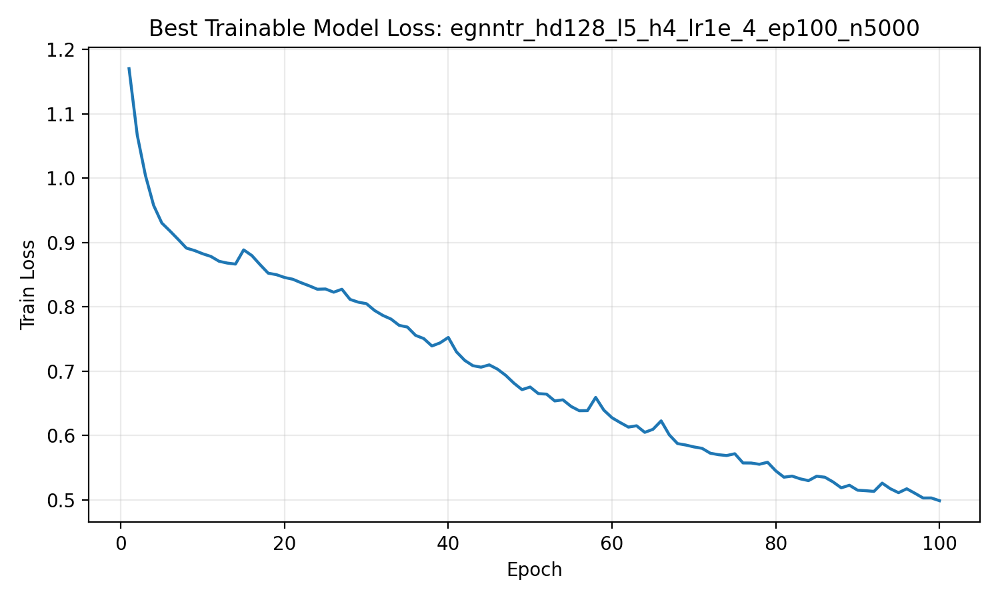

## 各方法最佳模型误差分布对比
- 选择每种方法的最佳模型（按 mean RMSD），对其 `per_sample` 误差做箱线图。
- 箱线图: 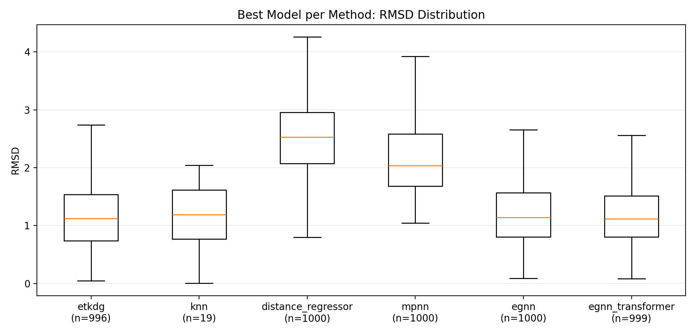

| method | run_tag | mean | median | eval | per_sample_n | params |
| --- | --- | --- | --- | --- | --- | --- |
| etkdg | `etkdg_c1_mmff0_seed0_it200` | 1.147 | 1.123 | 996/4 | 996 | c1, mmff0, it200 |
| knn | `knn_k1_r2_b2048_chir0_n2000` | 1.147 | 1.189 | 19/981 | 19 | k1, r2, b2048, chir0 |
| distance_regressor | `distreg_rf_md6_mmff0_n5000` | 2.517 | 2.531 | 1000/0 | 1000 | rf, md6, mmff0 |
| mpnn | `mpnn_hd128_l5_lr1e_4_ep100_n6151` | 2.244 | 2.035 | 1000/0 | 1000 | l5, hd128 |
| egnn | `egnn_hd128_l5_lr1e_4_ep100_n1000` | 1.197 | 1.140 | 1000/0 | 1000 | l5, hd128 |
| egnn_transformer | `egnntr_hd128_l5_h4_lr1e_4_ep100_n5000` | 1.162 | 1.118 | 999/1 | 999 | l5, h4, hd128 |
- 柱状图（最佳模型 mean/median RMSD）: 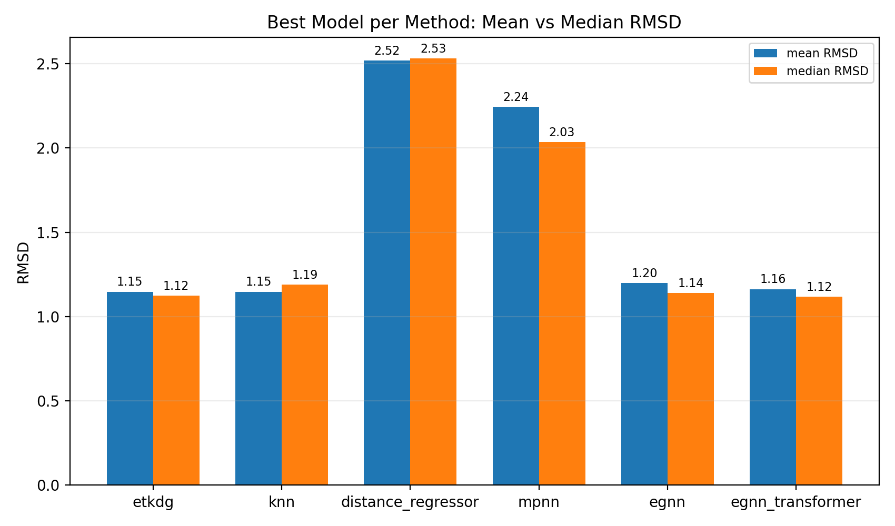
<!-- AUTO-PLOTS-END -->

<!-- AUTO-EXTRA-START -->
## 训练规模与效果（RMSD）
- 使用每种方法在同一训练规模下的最佳结果（按 mean RMSD）。
- 曲线图: 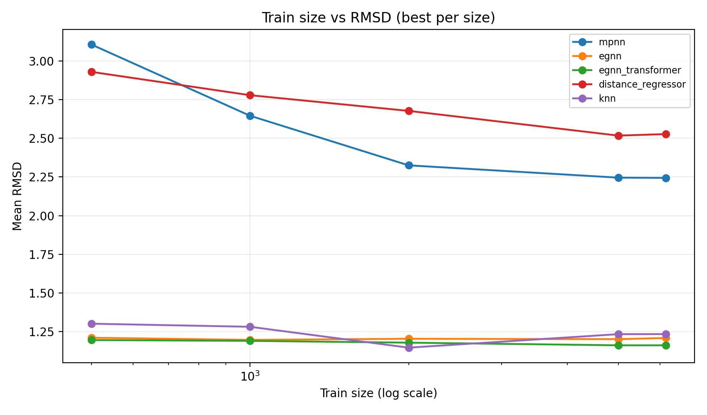

| train_size | mpnn | egnn | egnn_transformer | distance_regressor | knn |
| --- | --- | --- | --- | --- | --- |
| 500 | 3.106 (med 3.023) | 1.211 (med 1.144) | 1.196 (med 1.149) | 2.929 (med 2.924) | 1.302 (med 1.335) |
| 1000 | 2.646 (med 2.545) | 1.197 (med 1.140) | 1.191 (med 1.147) | 2.779 (med 2.789) | 1.282 (med 1.335) |
| 2000 | 2.325 (med 2.119) | 1.205 (med 1.144) | 1.179 (med 1.139) | 2.677 (med 2.680) | 1.147 (med 1.189) |
| 5000 | 2.246 (med 2.029) | 1.202 (med 1.134) | 1.162 (med 1.118) | 2.517 (med 2.531) | 1.234 (med 1.302) |
| 6151 | 2.244 (med 2.035) | 1.210 (med 1.136) | 1.162 (med 1.129) | 2.527 (med 2.541) | 1.235 (med 1.302) |

## 参数效率与训练成本
- RMSD vs 参数量: 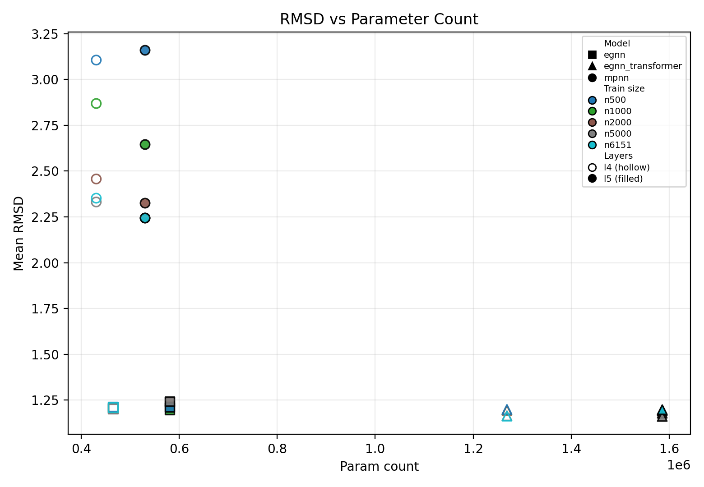
- RMSD vs 训练耗时: 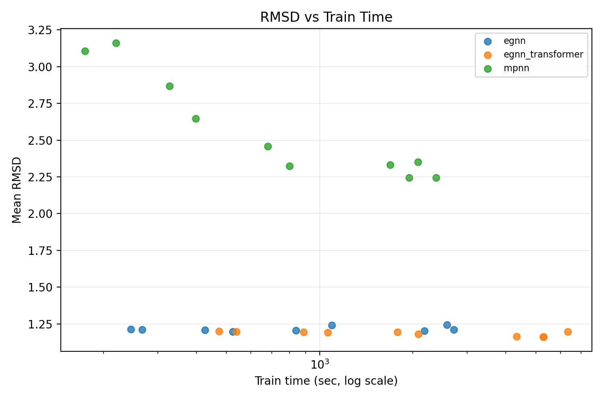

| method | run_tag | mean | params | train_time_sec |
| --- | --- | --- | --- | --- |
| mpnn | `mpnn_hd128_l5_lr1e_4_ep100_n6151` | 2.244 | 529793 | 2382.2 |
| egnn | `egnn_hd128_l5_lr1e_4_ep100_n1000` | 1.197 | 580613 | 524.6 |
| egnn_transformer | `egnntr_hd128_l5_h4_lr1e_4_ep100_n5000` | 1.162 | 1585433 | 5279.3 |

## 误差分解：按分子属性分桶
- heavy_atoms 分桶热图: 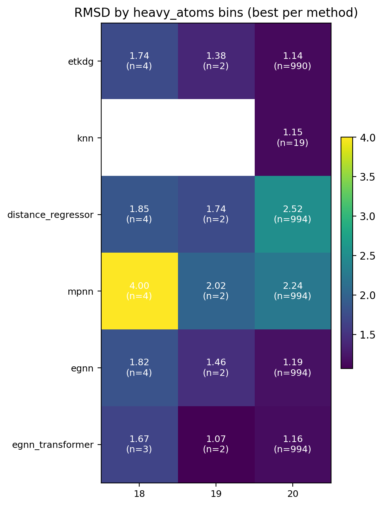
- rot_bonds 分桶热图: 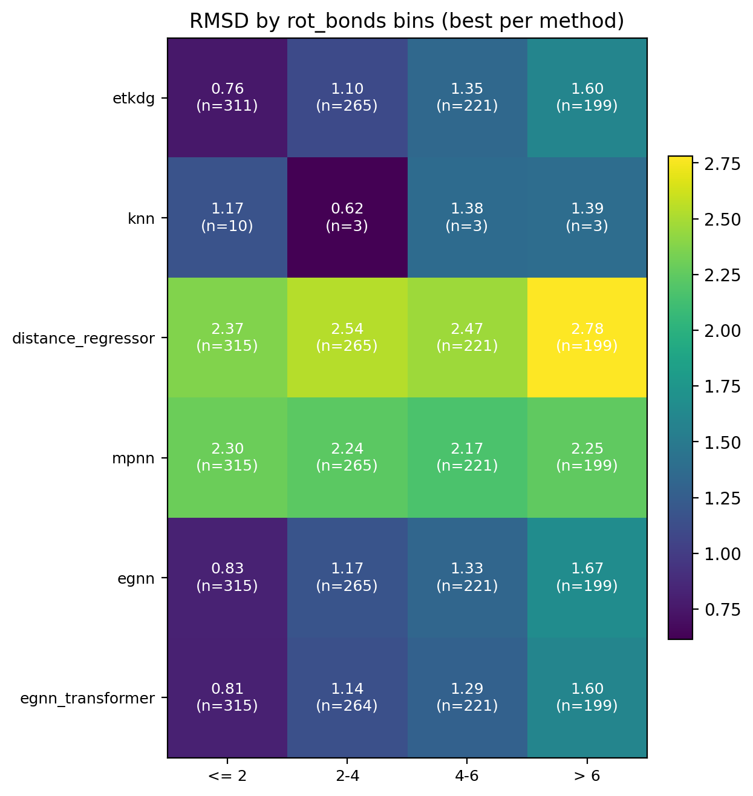
- rings 分桶热图: 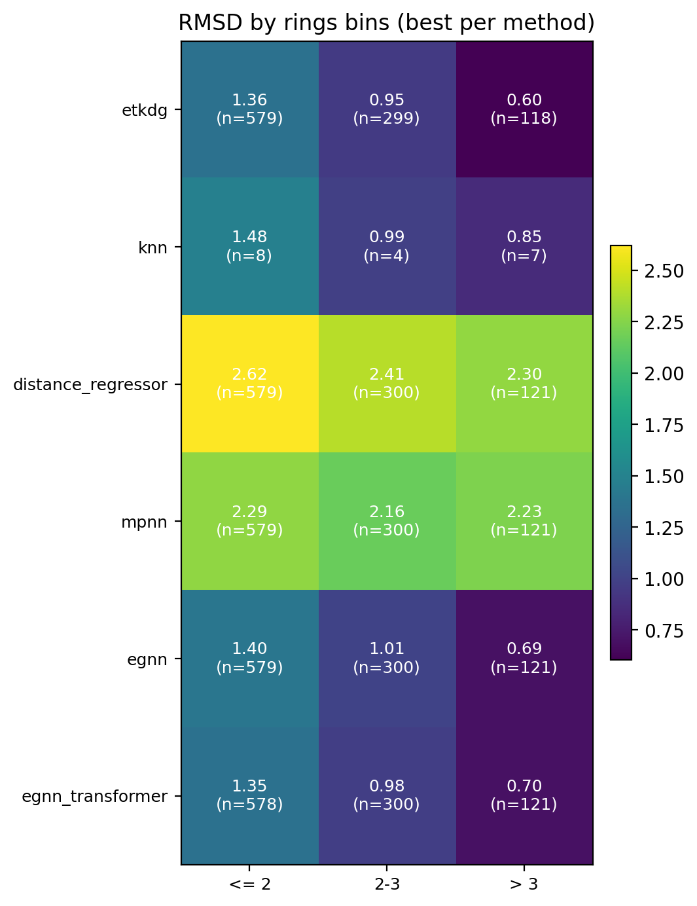

| property | bins |
| --- | --- |
| heavy_atoms | 18, 19, 20 |
| rot_bonds | <= 2, 2-4, 4-6, > 6 |
| rings | <= 2, 2-3, > 3 |

## 失败样本分析（每种方法最佳模型）
| method | run_tag | ok | skipped | top_reasons |
| --- | --- | --- | --- | --- |
| etkdg | `etkdg_c1_mmff0_seed0_it200` | 996 | 4 | missing_prediction:4 |
| knn | `knn_k1_r2_b2048_chir0_n2000` | 19 | 981 | missing_prediction:981 |
| distance_regressor | `distreg_rf_md6_mmff0_n5000` | 1000 | 0 | NA |
| mpnn | `mpnn_hd128_l5_lr1e_4_ep100_n6151` | 1000 | 0 | NA |
| egnn | `egnn_hd128_l5_lr1e_4_ep100_n1000` | 1000 | 0 | NA |
| egnn_transformer | `egnntr_hd128_l5_h4_lr1e_4_ep100_n5000` | 999 | 1 | atom_count_mismatch:1 |

## 方法间逐样本对比（胜率）
- 胜率表示 A 的 RMSD 小于 B 的比例（含 0.5 的平局计数），括号内为参与比较的样本数。

| A\B | etkdg | knn | distance_regressor | mpnn | egnn | egnn_transformer |
| --- | --- | --- | --- | --- | --- | --- |
| etkdg | — | 0.37 (n=19) | 0.93 (n=996) | 0.87 (n=996) | 0.54 (n=996) | 0.50 (n=995) |
| knn | 0.63 (n=19) | — | 0.79 (n=19) | 0.89 (n=19) | 0.68 (n=19) | 0.53 (n=19) |
| distance_regressor | 0.07 (n=996) | 0.21 (n=19) | — | 0.36 (n=1000) | 0.07 (n=1000) | 0.07 (n=999) |
| mpnn | 0.13 (n=996) | 0.11 (n=19) | 0.64 (n=1000) | — | 0.12 (n=1000) | 0.11 (n=999) |
| egnn | 0.46 (n=996) | 0.32 (n=19) | 0.93 (n=1000) | 0.88 (n=1000) | — | 0.42 (n=999) |
| egnn_transformer | 0.50 (n=995) | 0.47 (n=19) | 0.93 (n=999) | 0.89 (n=999) | 0.58 (n=999) | — |

### 训练类模型胜率与平均差值
| A\B | mpnn | egnn | egnn_transformer |
| --- | --- | --- | --- |
| mpnn | — | 0.12 (Δ=1.047, n=1000) | 0.11 (Δ=1.080, n=999) |
| egnn | 0.88 (Δ=-1.047, n=1000) | — | 0.42 (Δ=0.035, n=999) |
| egnn_transformer | 0.89 (Δ=-1.080, n=999) | 0.58 (Δ=-0.035, n=999) | — |

## 统计稳定性（Bootstrap 95% CI）
- 每个方法选取其最佳模型（按 mean RMSD），bootstrap 次数=500。

| method | run_tag | n | mean | mean_ci | median | median_ci |
| --- | --- | --- | --- | --- | --- | --- |
| etkdg | `etkdg_c1_mmff0_seed0_it200` | 996 | 1.147 | [1.111, 1.184] | 1.123 | [1.071, 1.154] |
| knn | `knn_k1_r2_b2048_chir0_n2000` | 19 | 1.147 | [0.879, 1.387] | 1.189 | [0.868, 1.582] |
| egnn_transformer | `egnntr_hd128_l5_h4_lr1e_4_ep100_n5000` | 999 | 1.162 | [1.126, 1.198] | 1.118 | [1.078, 1.154] |
| egnn | `egnn_hd128_l5_lr1e_4_ep100_n1000` | 1000 | 1.197 | [1.163, 1.234] | 1.140 | [1.094, 1.178] |
| mpnn | `mpnn_hd128_l5_lr1e_4_ep100_n6151` | 1000 | 2.244 | [2.195, 2.291] | 2.035 | [1.991, 2.091] |
| distance_regressor | `distreg_rf_md6_mmff0_n5000` | 1000 | 2.517 | [2.476, 2.562] | 2.531 | [2.486, 2.584] |
<!-- AUTO-EXTRA-END -->

<!-- AUTO-OUTLIERS-START -->
## 极端样本可视化（每种方法最佳模型 Top-K）
- 在每种方法最佳模型中，取 RMSD 最大的 Top-5 样本进行可视化。

### etkdg
- 最佳模型: `etkdg_c1_mmff0_seed0_it200`
- Top-5 最大 RMSD 样本：
  - 可视化: 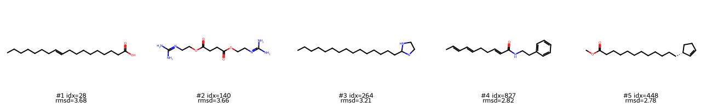

| rank | index | rmsd | smiles |
| --- | --- | --- | --- |
| 1 | 28 | 3.676 | `CCCCCCC/C=C/CCCCCCCCC(=O)O` |
| 2 | 140 | 3.664 | `NC(N)=NCCOC(=O)CCC(=O)OCCN=C(N)N` |
| 3 | 264 | 3.215 | `CCCCCCCCCCCCCCC[C]1[N]CCN1` |
| 4 | 827 | 2.822 | `C/C=C/C=C/CC/C=C/C(=O)NCCc1ccccc1` |
| 5 | 448 | 2.780 | `COC(=O)CCCCCCCCCCC[C@H]1C=CCC1` |

### knn
- 最佳模型: `knn_k1_r2_b2048_chir0_n2000`
- Top-5 最大 RMSD 样本：
  - 可视化: 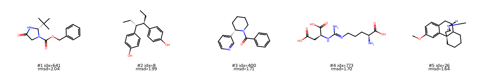

| rank | index | rmsd | smiles |
| --- | --- | --- | --- |
| 1 | 641 | 2.044 | `CC(C)(C)[C@H]1NC(=O)CN1C(=O)OCc1ccccc1` |
| 2 | 8 | 1.988 | `CC[C@@H](c1ccc(O)cc1)[C@@H](CC)c1ccc(O)cc1` |
| 3 | 400 | 1.705 | `O=C(c1ccccc1)N1CCCC[C@H]1c1cccnc1` |
| 4 | 773 | 1.700 | `N/C(=N\CCC[C@H](N)C(=O)O)N[C@@H](CC(=O)O)C(=O)O` |
| 5 | 26 | 1.644 | `COc1ccc2c(c1)[C@@]13CCCC[C@@H]1[C@@H](C2)N(C)CC3` |

### distance_regressor
- 最佳模型: `distreg_rf_md6_mmff0_n5000`
- Top-5 最大 RMSD 样本：
  - 可视化: 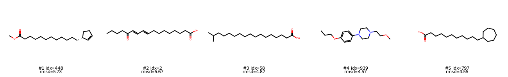

| rank | index | rmsd | smiles |
| --- | --- | --- | --- |
| 1 | 448 | 5.727 | `COC(=O)CCCCCCCCCCC[C@H]1C=CCC1` |
| 2 | 2 | 5.674 | `CCCCC(=O)/C=C/C=C/CCCCCCCC(=O)O` |
| 3 | 58 | 4.875 | `CC(C)CCCCCCCCCCCCCCC(=O)O` |
| 4 | 939 | 4.565 | `CCCOc1ccc(N2CCN(CCOC)CC2)cc1` |
| 5 | 797 | 4.550 | `O=C(O)CCCCCCCCCCC1CCCCCC1` |

### mpnn
- 最佳模型: `mpnn_hd128_l5_lr1e_4_ep100_n6151`
- Top-5 最大 RMSD 样本：
  - 可视化: 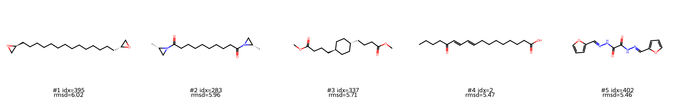

| rank | index | rmsd | smiles |
| --- | --- | --- | --- |
| 1 | 395 | 6.015 | `C(CCCCCCC[C@H]1CO1)CCCCCC[C@@H]1CO1` |
| 2 | 283 | 5.962 | `C[C@H]1CN1C(=O)CCCCCCCCC(=O)N1C[C@@H]1C` |
| 3 | 337 | 5.712 | `COC(=O)CCC[C@H]1CC[C@H](CCCC(=O)OC)CC1` |
| 4 | 2 | 5.474 | `CCCCC(=O)/C=C/C=C/CCCCCCCC(=O)O` |
| 5 | 402 | 5.461 | `O=C(N/N=C/c1ccco1)C(=O)N/N=C/c1ccco1` |

### egnn
- 最佳模型: `egnn_hd128_l5_lr1e_4_ep100_n1000`
- Top-5 最大 RMSD 样本：
  - 可视化: 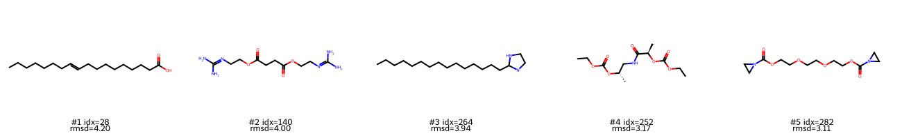

| rank | index | rmsd | smiles |
| --- | --- | --- | --- |
| 1 | 28 | 4.201 | `CCCCCCC/C=C/CCCCCCCCC(=O)O` |
| 2 | 140 | 4.000 | `NC(N)=NCCOC(=O)CCC(=O)OCCN=C(N)N` |
| 3 | 264 | 3.936 | `CCCCCCCCCCCCCCC[C]1[N]CCN1` |
| 4 | 252 | 3.170 | `CCOC(=O)O[C@@H](C)CNC(=O)[C@@H](C)OC(=O)OCC` |
| 5 | 282 | 3.108 | `O=C(OCCOCCOCCOC(=O)N1CC1)N1CC1` |

### egnn_transformer
- 最佳模型: `egnntr_hd128_l5_h4_lr1e_4_ep100_n5000`
- Top-5 最大 RMSD 样本：
  - 可视化: 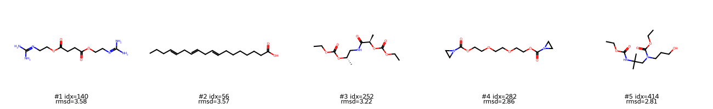

| rank | index | rmsd | smiles |
| --- | --- | --- | --- |
| 1 | 140 | 3.577 | `NC(N)=NCCOC(=O)CCC(=O)OCCN=C(N)N` |
| 2 | 56 | 3.574 | `CCC/C=C/C/C=C/C/C=C/CCCCCCC(=O)O` |
| 3 | 252 | 3.221 | `CCOC(=O)O[C@@H](C)CNC(=O)[C@@H](C)OC(=O)OCC` |
| 4 | 282 | 2.861 | `O=C(OCCOCCOCCOC(=O)N1CC1)N1CC1` |
| 5 | 414 | 2.808 | `CCOC(=O)NC(C)(C)CN(CCCO)C(=O)OCC` |

<!-- AUTO-OUTLIERS-END -->

<!-- AUTO-CDF-START -->
## RMSD CDF（每个方法最佳模型）
- 六个方法的最佳模型 RMSD CDF 曲线对比。
- 图像: 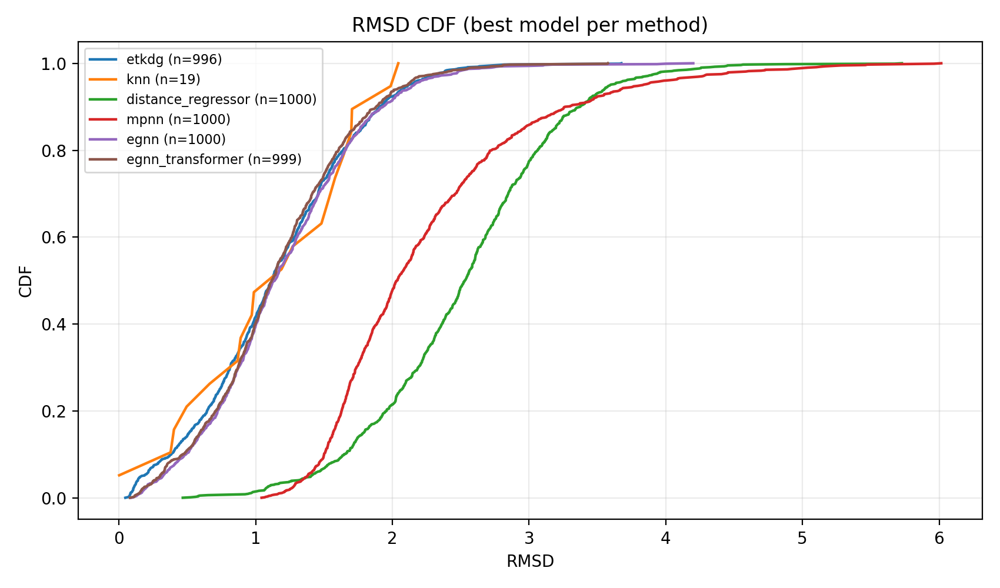

| method | run_tag | n | mean |
| --- | --- | --- | --- |
| etkdg | `etkdg_c1_mmff0_seed0_it200` | 996 | 1.147 |
| knn | `knn_k1_r2_b2048_chir0_n2000` | 19 | 1.147 |
| distance_regressor | `distreg_rf_md6_mmff0_n5000` | 1000 | 2.517 |
| mpnn | `mpnn_hd128_l5_lr1e_4_ep100_n6151` | 1000 | 2.244 |
| egnn | `egnn_hd128_l5_lr1e_4_ep100_n1000` | 1000 | 1.197 |
| egnn_transformer | `egnntr_hd128_l5_h4_lr1e_4_ep100_n5000` | 999 | 1.162 |
<!-- AUTO-CDF-END -->

## 各方法明细
### distance_regressor
- 最佳 mean: `distreg_rf_md6_mmff0_n5000` (mean=2.517, median=2.531)
- 最佳 median: `distreg_rf_md6_mmff0_n5000` (mean=2.517, median=2.531)

| run_tag | train_size | layers/heads | params | eval(count/skip) | mean | median | p90 | p95 | rmsd<2 | status |
| --- | --- | --- | --- | --- | --- | --- | --- | --- | --- | --- |
| `distreg_rf_md6_mmff0_n500` | 500 | rf, md6, mmff0 | NA | 1000/0 | 2.929 | 2.924 | 3.751 | 3.980 | 0.067 | ok |
| `distreg_rf_md6_mmff0_n1000` | 1000 | rf, md6, mmff0 | NA | 1000/0 | 2.779 | 2.789 | 3.599 | 3.855 | 0.111 | ok |
| `distreg_rf_md6_mmff0_n2000` | 2000 | rf, md6, mmff0 | NA | 1000/0 | 2.677 | 2.680 | 3.516 | 3.849 | 0.157 | ok |
| `distreg_rf_md6_mmff0_n5000` | 5000 | rf, md6, mmff0 | NA | 1000/0 | 2.517 | 2.531 | 3.375 | 3.595 | 0.214 | ok |
| `distreg_rf_md6_mmff0_n6151` | 6151 | rf, md6, mmff0 | NA | 1000/0 | 2.527 | 2.541 | 3.338 | 3.661 | 0.213 | ok |

### egnn
- 最佳 mean: `egnn_hd128_l5_lr1e_4_ep100_n1000` (mean=1.197, median=1.140)
- 最佳 median: `egnn_hd128_l4_lr1e_4_ep100_n5000` (mean=1.202, median=1.134)

| run_tag | train_size | layers/heads | params | eval(count/skip) | mean | median | p90 | p95 | rmsd<2 | status |
| --- | --- | --- | --- | --- | --- | --- | --- | --- | --- | --- |
| `egnn_hd128_l4_lr1e_4_ep100_n500` | 500 | l4 | 464,900 | 1000/0 | 1.213 | 1.163 | 1.952 | 2.149 | 0.908 | ok |
| `egnn_hd128_l5_lr1e_4_ep100_n500` | 500 | l5 | 580,613 | 999/1 | 1.211 | 1.144 | 1.938 | 2.164 | 0.917 | ok |
| `egnn_hd128_l4_lr1e_4_ep100_n1000` | 1000 | l4 | 464,900 | 1000/0 | 1.207 | 1.151 | 1.961 | 2.187 | 0.912 | ok |
| `egnn_hd128_l5_lr1e_4_ep100_n1000` | 1000 | l5 | 580,613 | 1000/0 | 1.197 | 1.140 | 1.930 | 2.159 | 0.914 | ok |
| `egnn_hd128_l4_lr1e_4_ep100_n2000` | 2000 | l4 | 464,900 | 1000/0 | 1.205 | 1.144 | 1.950 | 2.172 | 0.914 | ok |
| `egnn_hd128_l5_lr1e_4_ep100_n2000` | 2000 | l5 | 580,613 | 1000/0 | 1.240 | 1.159 | 2.005 | 2.262 | 0.898 | ok |
| `egnn_hd128_l4_lr1e_4_ep100_n5000` | 5000 | l4 | 464,900 | 1000/0 | 1.202 | 1.134 | 1.968 | 2.184 | 0.910 | ok |
| `egnn_hd128_l5_lr1e_4_ep100_n5000` | 5000 | l5 | 580,613 | 1000/0 | 1.242 | 1.170 | 1.987 | 2.207 | 0.901 | ok |
| `egnn_hd128_l4_lr1e_4_ep100_n6151` | 6151 | l4 | 464,900 | 1000/0 | 1.210 | 1.136 | 1.977 | 2.207 | 0.904 | ok |
| `egnn_hd128_l5_lr1e_4_ep100_n6151` | 6151 | l5 | 580,613 | 0/1000 | NA | NA | NA | NA | NA | nan |

- NaN/无效结果:
  - `egnn_hd128_l5_lr1e_4_ep100_n6151` (loss_history 出现 NaN)

### egnn_transformer
- 最佳 mean: `egnntr_hd128_l5_h4_lr1e_4_ep100_n5000` (mean=1.162, median=1.118)
- 最佳 median: `egnntr_hd128_l5_h4_lr1e_4_ep100_n5000` (mean=1.162, median=1.118)

| run_tag | train_size | layers/heads | params | eval(count/skip) | mean | median | p90 | p95 | rmsd<2 | status |
| --- | --- | --- | --- | --- | --- | --- | --- | --- | --- | --- |
| `egnntr_hd128_l4_h4_lr1e_4_ep100_n500` | 500 | l4/h4 | 1,268,756 | 999/1 | 1.199 | 1.146 | 1.957 | 2.169 | 0.913 | ok |
| `egnntr_hd128_l5_h4_lr1e_4_ep100_n500` | 500 | l5/h4 | 1,585,433 | 1000/0 | 1.196 | 1.149 | 1.910 | 2.147 | 0.922 | ok |
| `egnntr_hd128_l4_h4_lr1e_4_ep100_n1000` | 1000 | l4/h4 | 1,268,756 | 1000/0 | 1.195 | 1.161 | 1.947 | 2.182 | 0.913 | ok |
| `egnntr_hd128_l5_h4_lr1e_4_ep100_n1000` | 1000 | l5/h4 | 1,585,433 | 1000/0 | 1.191 | 1.147 | 1.933 | 2.151 | 0.916 | ok |
| `egnntr_hd128_l4_h4_lr1e_4_ep100_n2000` | 2000 | l4/h4 | 1,268,756 | 1000/0 | 1.194 | 1.158 | 1.943 | 2.147 | 0.912 | ok |
| `egnntr_hd128_l5_h4_lr1e_4_ep100_n2000` | 2000 | l5/h4 | 1,585,433 | 1000/0 | 1.179 | 1.139 | 1.901 | 2.144 | 0.926 | ok |
| `egnntr_hd128_l4_h4_lr1e_4_ep100_n5000` | 5000 | l4/h4 | 1,268,756 | 1000/0 | 1.165 | 1.127 | 1.901 | 2.142 | 0.927 | ok |
| `egnntr_hd128_l5_h4_lr1e_4_ep100_n5000` | 5000 | l5/h4 | 1,585,433 | 999/1 | 1.162 | 1.118 | 1.882 | 2.111 | 0.935 | ok |
| `egnntr_hd128_l4_h4_lr1e_4_ep100_n6151` | 6151 | l4/h4 | 1,268,756 | 1000/0 | 1.162 | 1.129 | 1.839 | 2.079 | 0.935 | ok |
| `egnntr_hd128_l5_h4_lr1e_4_ep100_n6151` | 6151 | l5/h4 | 1,585,433 | 1000/0 | 1.198 | 1.141 | 1.958 | 2.170 | 0.913 | ok |

### etkdg
- 最佳 mean: `etkdg_c1_mmff0_seed0_it200` (mean=1.147, median=1.123)
- 最佳 median: `etkdg_c1_mmff0_seed0_it200` (mean=1.147, median=1.123)

| run_tag | train_size | layers/heads | params | eval(count/skip) | mean | median | p90 | p95 | rmsd<2 | status |
| --- | --- | --- | --- | --- | --- | --- | --- | --- | --- | --- |
| `etkdg_c1_mmff0_seed0_it200` | NA | c1, mmff0, seed0, it200 | NA | 996/4 | 1.147 | 1.123 | 1.906 | 2.120 | 0.923 | ok |

### knn
- 最佳 mean: `knn_k1_r2_b2048_chir0_n2000` (mean=1.147, median=1.189)
- 最佳 median: `knn_k1_r2_b2048_chir0_n2000` (mean=1.147, median=1.189)

| run_tag | train_size | layers/heads | params | eval(count/skip) | mean | median | p90 | p95 | rmsd<2 | status |
| --- | --- | --- | --- | --- | --- | --- | --- | --- | --- | --- |
| `knn_k1_r2_b2048_chir0_n500` | 500 | k1, r2, b2048, chir0 | NA | 10/990 | 1.302 | 1.335 | 1.700 | 1.703 | 1.000 | ok |
| `knn_k1_r2_b2048_chir0_n1000` | 1000 | k1, r2, b2048, chir0 | NA | 12/988 | 1.282 | 1.335 | 1.705 | 1.832 | 1.000 | ok |
| `knn_k1_r2_b2048_chir0_n2000` | 2000 | k1, r2, b2048, chir0 | NA | 19/981 | 1.147 | 1.189 | 1.762 | 1.993 | 0.947 | ok |
| `knn_k1_r2_b2048_chir0_n5000` | 5000 | k1, r2, b2048, chir0 | NA | 52/948 | 1.234 | 1.302 | 2.018 | 2.145 | 0.885 | ok |
| `knn_k1_r2_b2048_chir0_n6151` | 6151 | k1, r2, b2048, chir0 | NA | 52/948 | 1.235 | 1.302 | 2.018 | 2.145 | 0.885 | ok |

### mpnn
- 最佳 mean: `mpnn_hd128_l5_lr1e_4_ep100_n6151` (mean=2.244, median=2.035)
- 最佳 median: `mpnn_hd128_l5_lr1e_4_ep100_n5000` (mean=2.246, median=2.029)

| run_tag | train_size | layers/heads | params | eval(count/skip) | mean | median | p90 | p95 | rmsd<2 | status |
| --- | --- | --- | --- | --- | --- | --- | --- | --- | --- | --- |
| `mpnn_hd128_l4_lr1e_4_ep100_n500` | 500 | l4 | 430,849 | 1000/0 | 3.106 | 3.023 | 3.772 | 4.053 | 0.001 | ok |
| `mpnn_hd128_l5_lr1e_4_ep100_n500` | 500 | l5 | 529,793 | 1000/0 | 3.160 | 3.058 | 3.835 | 4.071 | 0.000 | ok |
| `mpnn_hd128_l4_lr1e_4_ep100_n1000` | 1000 | l4 | 430,849 | 1000/0 | 2.869 | 2.782 | 3.659 | 3.983 | 0.027 | ok |
| `mpnn_hd128_l5_lr1e_4_ep100_n1000` | 1000 | l5 | 529,793 | 1000/0 | 2.646 | 2.545 | 3.493 | 3.936 | 0.144 | ok |
| `mpnn_hd128_l4_lr1e_4_ep100_n2000` | 2000 | l4 | 430,849 | 1000/0 | 2.457 | 2.323 | 3.359 | 3.887 | 0.281 | ok |
| `mpnn_hd128_l5_lr1e_4_ep100_n2000` | 2000 | l5 | 529,793 | 1000/0 | 2.325 | 2.119 | 3.356 | 3.846 | 0.417 | ok |
| `mpnn_hd128_l4_lr1e_4_ep100_n5000` | 5000 | l4 | 430,849 | 1000/0 | 2.332 | 2.166 | 3.277 | 3.842 | 0.403 | ok |
| `mpnn_hd128_l5_lr1e_4_ep100_n5000` | 5000 | l5 | 529,793 | 1000/0 | 2.246 | 2.029 | 3.230 | 3.831 | 0.481 | ok |
| `mpnn_hd128_l4_lr1e_4_ep100_n6151` | 6151 | l4 | 430,849 | 1000/0 | 2.352 | 2.211 | 3.268 | 3.910 | 0.375 | ok |
| `mpnn_hd128_l5_lr1e_4_ep100_n6151` | 6151 | l5 | 529,793 | 1000/0 | 2.244 | 2.035 | 3.267 | 3.833 | 0.477 | ok |

## GNN 横向对比 (按训练规模)

| train_size | mpnn | egnn | egnn_transformer |
| --- | --- | --- | --- |
| 500 | 3.106 (median 3.023) | 1.211 (median 1.144) | 1.196 (median 1.149) |
| 1000 | 2.646 (median 2.545) | 1.197 (median 1.140) | 1.191 (median 1.147) |
| 2000 | 2.325 (median 2.119) | 1.205 (median 1.144) | 1.179 (median 1.139) |
| 5000 | 2.246 (median 2.029) | 1.202 (median 1.134) | 1.162 (median 1.118) |
| 6151 | 2.244 (median 2.035) | 1.210 (median 1.136) | 1.162 (median 1.129) |

## 结论与观察
- EGNN 的 `egnn_hd128_l5_lr1e_4_ep100_n6151` 训练发散，输出坐标包含 NaN，导致评估全跳过。
- 大多数有效结果的评估样本数为 1000，说明测试集总量一致；KNN 在多个规模上仅评估了很少样本（如 10/1000），需谨慎解读。
- ETKDG 在当前设置下给出最优 mean，但这是非学习方法（c1, mmff0），适合作为强基线对比。
- GNN 里 EGNN+Transformer 整体优于 EGNN，二者显著优于 MPNN；在 5000 与 6151 规模间提升已趋于饱和。
- 对比建议：优先对 mean/median RMSD 最优的配置做进一步实验。
